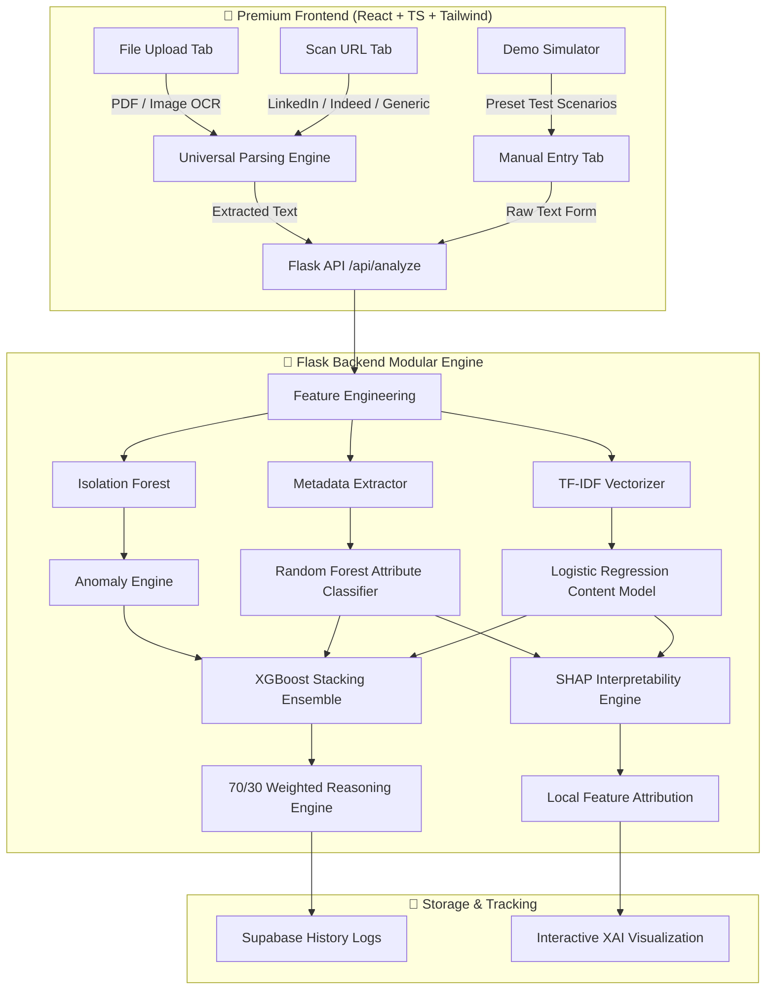

# 🛡️ RecruitGuard — Enterprise-Grade AI Job Fraud Detection Platform

[](https://www.python.org/)
[](https://flask.palletsprojects.com/)
[](https://reactjs.org/)
[](https://vitejs.dev/)
[](https://www.docker.com/)
[]()

RecruitGuard is a production-ready, full-stack **Explainable AI (XAI)** platform that detects fraudulent job postings in real time. It replaces standard rule-based heuristics with an honest, multi-algorithm machine learning pipeline, featuring real dataset training, interactive demo simulations, universal inputs (URLs, PDFs, Images), and automated SHAP interpretability.

---

## 🏗️ System Architecture



---

## 🧠 Machine Learning Engine & Algorithms

RecruitGuard avoids deceptive labels by implementing highly transparent and rigorously trained algorithms:

1. **Text Content Analyzer (`TF-IDF + Logistic Regression`)**: Trained on real job postings to classify linguistic scam indicators (e.g., urgency, passive income promises, unverified contact domains).
2. **Metadata Classifier (`Random Forest`)**: Examines 6 structural parameters (salary range presence, company profile, logo existence, question counts, telecommuting flag, and requirements completeness) using a 100-tree forest.
3. **Anomaly Engine (`Isolation Forest`)**: Unsupervised anomaly detection that flags postings deviating statistically from standard job structures.
4. **Stacking Ensemble (`XGBoost`)**: Meta-classifier that integrates predictions from all sub-models for highly stable decision boundaries.

### 📐 The 70/30 Hybrid Scoring Formula

$$\text{Final Fraud Risk} = (0.7 \times \text{Content Score}) + (0.3 \times \text{Metadata Score})$$

- **Content Score (70%)**: Focuses heavily on linguistic styles and textual indicators.
- **Metadata Score (30%)**: Evaluates structural completeness and administrative indicators.

---

## 🔍 SHAP Explainable AI (XAI)

RecruitGuard integrates an active **SHAP (SHapley Additive exPlanations)** interpretability pipeline. For every single analysis, it calculates:
- **Linguistic Drivers**: Precise additive contribution of individual words to the text classification.
- **Structural Drivers**: Impact of specific missing metadata attributes on Random Forest classification.

---

## 🚀 How to Run Locally

### 🐳 Method 1: Docker (Recommended)
Launch the entire system containerized with a single command:
```sh
docker-compose up --build
```
- **Frontend URL**: `http://localhost:8080`
- **Backend API**: `http://localhost:5000`

---

### 💻 Method 2: Manual Local Setup

#### Prerequisites
- **Node.js** 18+
- **Python** 3.11+
- **Tesseract OCR** (for image text extraction)

#### 1. Start the Flask Backend
```sh
cd backend
# Create and activate virtual environment
python -m venv venv
source venv/bin/activate  # On Windows: venv\Scripts\activate

# Install requirements
pip install -r requirements.txt

# Generate dataset and train models
python scripts/generate_dataset.py
python scripts/train_models.py

# Run API Server
python app.py
```

#### 2. Start the React Frontend
```sh
cd frontend
npm install
npm run dev
```

---

## 🔌 API Documentation

### 1. Main Analysis Endpoint
- **URL**: `/api/analyze`
- **Method**: `POST`
- **Request Body**:
```json
{
  "title": "Data Entry Specialist",
  "company": "FastCash Inc",
  "description": "No experience required. Work from home. Earn $5000 guaranteed weekly. WhatsApp us.",
  "requirements": "None",
  "salary": "$200/hr",
  "email": "hr@gmail.com",
  "location": "Anywhere"
}
```

- **Response Body**:
```json
{
  "isFake": true,
  "confidence": 88,
  "textScore": 92,
  "metadataScore": 75,
  "riskLevel": "CRITICAL",
  "insights": [
    "Contact email uses a personal domain (gmail/yahoo/hotmail)",
    "Suspicious phrase detected: 'work from home'"
  ],
  "shapExplanation": {
    "text": {
      "fraud_drivers": [
        { "word": "guaranteed", "shap_value": 0.45 },
        { "word": "whatsapp", "shap_value": 0.38 }
      ],
      "legit_drivers": []
    }
  },
  "status": "success"
}
```

---

## 📁 Project Structure

```
job-main/
├── backend/                  ← "The Brain": Flask ML Backend
│   ├── api/                  ← Web routes and controllers
│   │   ├── universal_input.py← URL Scrapers, PDFs and OCR
│   │   └── routes.py         ← Main inference & SHAP gateway
│   ├── core/                 ← Machine Learning Models
│   │   ├── engines/          ← Model predictors
│   │   │   └── explainability.py ← SHAP engine
│   │   └── logic/            ← Scoring algorithms
│   ├── models/               ← Serialized artifacts (.pkl)
│   ├── scripts/              ← Training & data generators
│   └── app.py                ← Production Flask Entry
├── frontend/                 ← "The Face": React Web App
│   ├── src/
│   │   ├── components/       ← UI Widgets & XAI Panels
│   │   │   └── SHAPExplanationPanel.tsx ← Visual SHAP charts
│   │   └── pages/            ← Application views
└── docker-compose.yml        ← Production orchestrator
```
